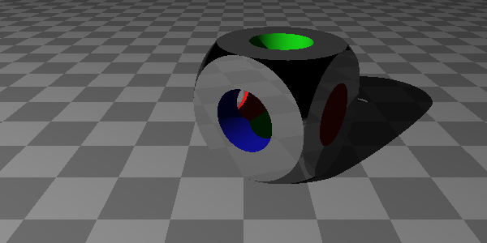

# RayTracer
***Java RayTracer***

Ray Tracer exercises from [Ray Tracer
Challenge](https://pragprog.com/book/jbtracer/the-ray-tracer-challenge) book.

library/ contains the ray tracing libraries.
projects/ contains the executable projects. Most projects output a single image to the images/
directory. See projects/build.gradle for the executable task names.

## Libraries
Raytracing code at [library/](library/src/main/java/raytracer).

## Tests
`gradle test` to run the unit tests.

## Chapter 1: Tuples, Points, and Vectors
### Project: TextRocketTracker
Code at [projects/chapter1/TextRocketTracker.java](projects/src/main/java/projects/chapter1/TextRocketTracker.java).  
Execute: `gradle project:textrocket`  
Output: [text](projects/images/TextRocketTracker.out)

## Chapter 2: Drawing on a Canvas
### Project: CanvasRocketTracker
Code at [projects/chapter2/CanvasRocketTracker.java](projects/src/main/java/projects/chapter2/CanvasRocketTracker.java).  
Execute: `gradle project:canvasrocket`  
Output: 

## Chapter 3: Matrices
No projects

## Chapter 4: Matrix Transformations
### Project: Clock
Code at [projects/chapter4/Clock.java](projects/src/main/java/projects/chapter4/Clock.java).  
Execute: `gradle project:clock`  
Output: 

## Chapter 5: Ray-Sphere Intersections
### Project: Silhouette
Code at [projects/chapter5/Silhouette.java](projects/src/main/java/projects/chapter5/Silhouette.java).  
Execute: `gradle project:silhouette`  
Output: 

## Chapter 6: Light and Shading
### Project: Blue Ball
Code at [projects/chapter6/BlueBall.java](projects/src/main/java/projects/chapter6/BlueBall.java).  
Execute: `gradle project:blueball`  
Output: 

## Chapter 7: Making a Scene
### Project: Sphere Scene
Code at [projects/chapter7/SphereScene.java](projects/src/main/java/projects/chapter7/SphereScene.java).  
Execute: `gradle project:sphere`  
Output: 

## Chapter 8: Shadows
Shadows added to core system. See Chapter 7 project.

## Chapter 9: Planes
### Project: Plane Scene
Code at [projects/chapter9/PlaneScene.java](projects/src/main/java/projects/chapter9/PlaneScene.java).  
Execute: `gradle project:plane`  
Output: 

## Chapter 10: Patterns
### Project: Stripe Balls
Code at [projects/chapter10/StripeBalls.java](projects/src/main/java/projects/chapter10/StripeBalls.java).  
Execute: `gradle project:stripeballs`  
Output: 

## Chapter 11: Reflection and Refraction
### Project: Reflection
Code at [projects/chapter11/ReflectScene.java](projects/src/main/java/projects/chapter11/ReflectScene.java).  
Execute: `gradle project:reflect`  
Output: 

### Project: Refraction
Code at [projects/chapter11/RefractScene.java](projects/src/main/java/projects/chapter11/RefractScene.java).  
Execute: `gradle project:refract`  
Output: 

## Chapter 12: Cubes
### Project: Cubes
Code at [projects/chapter12/CubeScene.java](projects/src/main/java/projects/chapter12/CubeScene.java).  
Execute: `gradle project:cubes`  
Output: 

## Chapter 13: Cylinders
### Project: Cylinders
Code at [projects/chapter13/CylinderScene.java](projects/src/main/java/projects/chapter13/CylinderScene.java).  
Execute: `gradle project:cylinders`  
Output: 

### Project: Cones
Code at [projects/chapter13/ConeScene.java](projects/src/main/java/projects/chapter13/ConeScene.java).  
Execute: `gradle project:cones`  
Output: 

## Chapter 14: Groups
### Project: Hexagons
Code at [projects/chapter14/HexagonScene.java](projects/src/main/java/projects/chapter14/HexagonScene.java),
[Hexagon.java](projects/src/main/java/projects/chapter14/Hexagon.java).  
Execute: `gradle project:hexagon`  
Output: 

## Chapter 15: Triangles
### Project: Teapot
Code at [projects/chapter15/TeapotScene.java](projects/src/main/java/projects/chapter15/TeapotScene.java).  
Execute: `gradle project:teapot`  
Output:   
Output with reflections: 

## Chapter 16: Constructive Solid Geometry (CSG)
### Project: CSG
Code at [projects/chapter16/CsgScene.java](projects/src/main/java/projects/chapter16/CsgScene.java).  
Execute: `gradle project:csg`  
Output: 

### Project: Round Hole Cube
Code at [projects/chapter16/RoundHoleCubeScene.java](projects/src/main/java/projects/chapter16/RoundHoleCubeScene.java).  
Execute: `gradle project:rhc`  
Output: 

## Chapter A1: Rendering the Cover Image
### Project: Cover
Code at [projects/appendix1/CoverWorld.java](projects/src/main/java/projects/appendix1/CoverWorld.java).  
Execute: `gradle project:cover`  
Output: 
